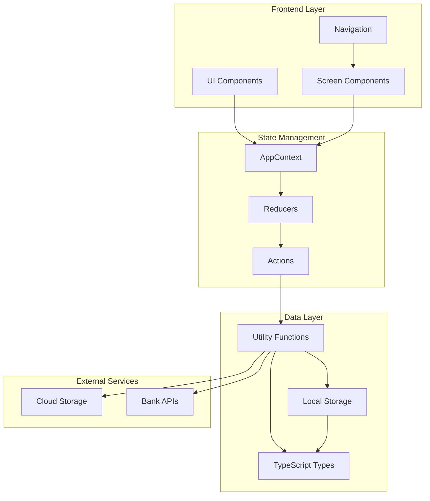
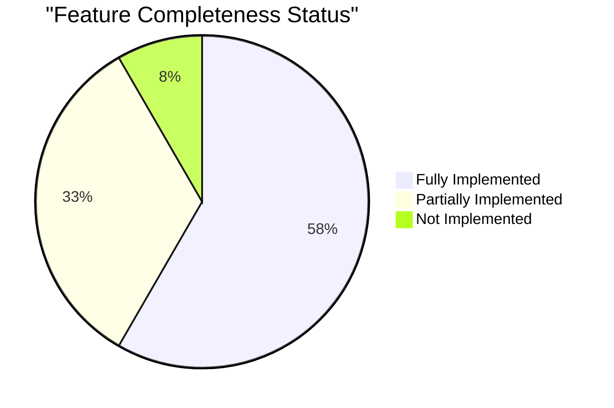
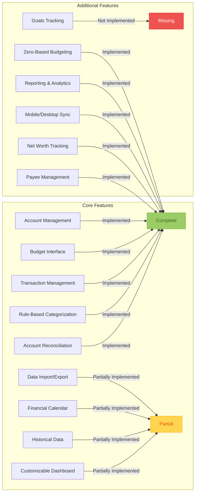
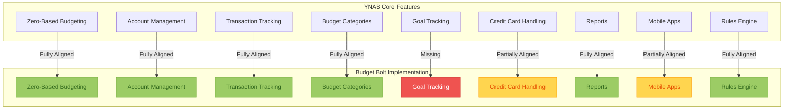
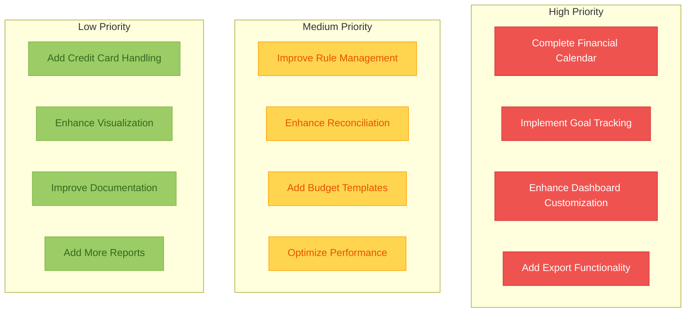

# Budget Bolt Architecture and Feature Completeness Diagrams

## Application Architecture



## Feature Completeness Overview



## Feature Implementation Details



## YNAB Alignment Assessment



## Improvement Priorities



## Platform Support Status

```mermaid
graph LR
    subgraph "Platform Support"
        P1[Windows Web] --> |Implemented| Complete
        P2[iOS] --> |Planned| Pending
        P3[Android] --> |Future| NotStarted
    end
    
    classDef complete fill:#9CCC65,stroke:#7CB342,color:#33691E
    classDef pending fill:#FFD54F,stroke:#FFA000,color:#E65100
    classDef notStarted fill:#EF5350,stroke:#D32F2F,color:#FFFFFF
    
    class Complete complete
    class Pending pending
    class NotStarted notStarted