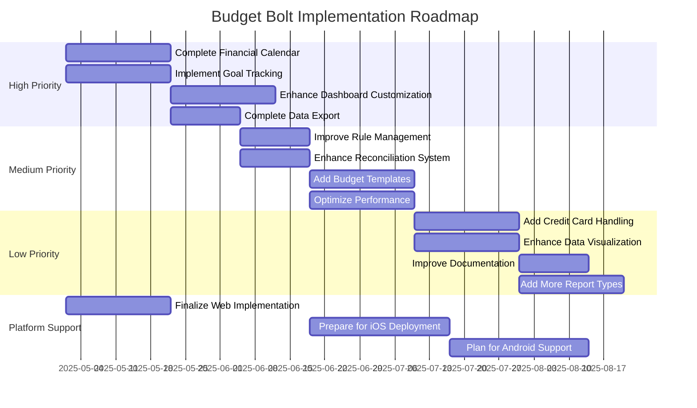

# Budget Bolt: Recommended Next Steps

This document outlines the prioritized action items for completing the Budget Bolt application according to the original requirements. It provides a roadmap for future development efforts, organized by priority and estimated effort.

## High Priority Items

These items should be addressed first to complete the core functionality of the application.

### 1. Complete Financial Calendar with Forecasting

**Current Status:** Partially implemented with basic calendar functionality.

**Required Actions:**
- Implement interactive forecasting with "what-if" scenarios
- Add drag-and-drop rescheduling of events
- Create color-coded indicators for cash-flow gaps
- Develop multiple calendar views (daily, weekly, monthly, agenda)
- Integrate calendar events with budget projections

**Estimated Effort:** Medium (2-3 weeks)

**Key Files to Modify:**
- `components/calendar/CalendarEventItem.tsx`
- Create new components for different calendar views
- Create forecasting utility functions
- Update AppContext to support forecasting data

### 2. Implement Goal Tracking System

**Current Status:** Not implemented.

**Required Actions:**
- Create data model for financial goals
- Develop UI for creating and managing goals
- Implement progress tracking and visualization
- Integrate goals with budget categories
- Add goal suggestions based on spending patterns

**Estimated Effort:** Medium (2-3 weeks)

**Implementation Approach:**
- Create new types for goals (`types/goals.ts`)
- Develop goal management components
- Add goal tracking to dashboard
- Integrate with budget system for progress updates

### 3. Enhance Dashboard Customization

**Current Status:** Basic dashboard with limited widgets.

**Required Actions:**
- Implement drag-and-drop widget functionality
- Create additional widget types (spending heatmap, goal progress, etc.)
- Add user-specific dashboard configurations
- Develop widget settings and customization options

**Estimated Effort:** Medium (2-3 weeks)

**Key Files to Modify:**
- `app/(tabs)/index.tsx`
- Create new dashboard widget components
- Add dashboard configuration to AppContext
- Implement drag-and-drop functionality

### 4. Complete Data Export Functionality

**Current Status:** Import functionality exists, but export is limited.

**Required Actions:**
- Implement export to CSV, OFX, QIF formats
- Add selective export options (date ranges, accounts, categories)
- Create export settings and configuration
- Add scheduled/automated exports

**Estimated Effort:** Small (1-2 weeks)

**Key Files to Modify:**
- Create new export components
- Add export utility functions
- Integrate with existing import/export system

## Medium Priority Items

These items enhance existing functionality and improve user experience.

### 1. Improve Rule Management

**Current Status:** Basic rule functionality implemented.

**Required Actions:**
- Add support for regular expressions in rules
- Implement rule testing and preview functionality
- Enhance rule management interface
- Add rule templates and suggestions

**Estimated Effort:** Small (1-2 weeks)

**Key Files to Modify:**
- `utils/ruleUtils.ts`
- `app/(tabs)/rules.tsx`
- Update rule-related components

### 2. Enhance Reconciliation System

**Current Status:** Basic reconciliation functionality implemented.

**Required Actions:**
- Improve auto-suggestion for transaction matches
- Enhance visualization of reconciliation progress
- Add more robust reconciliation snapshots
- Implement statement import for reconciliation

**Estimated Effort:** Small (1-2 weeks)

**Key Files to Modify:**
- `components/reconciliation/ReconciliationWizard.tsx`
- `components/reconciliation/ReconciliationHistory.tsx`
- `utils/reconciliationUtils.ts`

### 3. Add Budget Templates

**Current Status:** Basic budget functionality without templates.

**Required Actions:**
- Implement budget templates for quick setup
- Add copy functionality between budget periods
- Create budget presets based on income and common categories
- Develop budget version history

**Estimated Effort:** Medium (2-3 weeks)

**Implementation Approach:**
- Add template functionality to budget types and utils
- Create template selection interface
- Implement budget copying and versioning

### 4. Optimize Performance

**Current Status:** Basic implementation without specific performance optimizations.

**Required Actions:**
- Implement virtualization for large lists
- Optimize state management for complex operations
- Add caching mechanisms for frequently accessed data
- Improve loading states and feedback

**Estimated Effort:** Medium (2-3 weeks)

**Implementation Approach:**
- Add virtualized lists for transactions and other large datasets
- Optimize context providers and reducers
- Implement efficient data loading strategies

## Low Priority Items

These items add polish and additional functionality but are not critical for core functionality.

### 1. Add Credit Card Handling

**Current Status:** Basic account management without specific credit card features.

**Required Actions:**
- Implement specialized credit card account type
- Add credit card payment tracking
- Create credit card-specific reports
- Develop interest and fee tracking

**Estimated Effort:** Medium (2-3 weeks)

**Implementation Approach:**
- Enhance account types to support credit card specifics
- Add credit card payment functionality
- Create specialized reports for credit cards

### 2. Enhance Data Visualization

**Current Status:** Basic charts and visualizations.

**Required Actions:**
- Add more chart types and visualization options
- Implement interactive charts with drill-down capability
- Create customizable visualization settings
- Add export options for charts and graphs

**Estimated Effort:** Medium (2-3 weeks)

**Implementation Approach:**
- Enhance existing chart components
- Add new visualization libraries if needed
- Create more robust data transformation utilities

### 3. Improve Documentation

**Current Status:** Limited in-app help and documentation.

**Required Actions:**
- Create comprehensive in-app help system
- Add tooltips and contextual help
- Develop user guides and tutorials
- Implement onboarding flows for new users

**Estimated Effort:** Small (1-2 weeks)

**Implementation Approach:**
- Create help content system
- Add tooltips to complex UI elements
- Develop guided tours for key features

### 4. Add More Report Types

**Current Status:** Basic reporting functionality implemented.

**Required Actions:**
- Add specialized report types (tax reports, spending analysis, etc.)
- Implement report scheduling and sharing
- Create PDF export for reports
- Add report annotations and notes

**Estimated Effort:** Medium (2-3 weeks)

**Key Files to Modify:**
- `types/reports.ts`
- `utils/reportUtils.ts`
- `app/(tabs)/reports.tsx`
- Add new report template components

## Platform Support Enhancements

### 1. Finalize Web Implementation

**Current Status:** Basic web implementation.

**Required Actions:**
- Optimize for different browsers and screen sizes
- Enhance offline support
- Improve performance for large datasets
- Add progressive web app capabilities

**Estimated Effort:** Medium (2-3 weeks)

### 2. Prepare for iOS Deployment

**Current Status:** Basic structure exists but needs optimization.

**Required Actions:**
- Complete iOS-specific UI optimizations
- Test thoroughly on iOS devices
- Prepare App Store assets and descriptions
- Implement TestFlight for beta testing

**Estimated Effort:** Large (3-4 weeks)

### 3. Plan for Android Support

**Current Status:** Not started.

**Required Actions:**
- Assess React Native compatibility issues
- Plan Android-specific UI adaptations
- Develop Android testing strategy
- Evaluate Google Play Store requirements

**Estimated Effort:** Large (4+ weeks)

## Implementation Roadmap

## Conclusion

By following this roadmap, the Budget Bolt application can be completed according to the original requirements while maintaining a structured and prioritized approach to development. The high-priority items should be addressed first to ensure the core functionality is complete, followed by medium and low-priority items to enhance the user experience and add additional features.

The estimated timeline assumes a small development team (2-3 developers) working concurrently on different features. The actual timeline may vary based on team size, skill levels, and other project commitments.